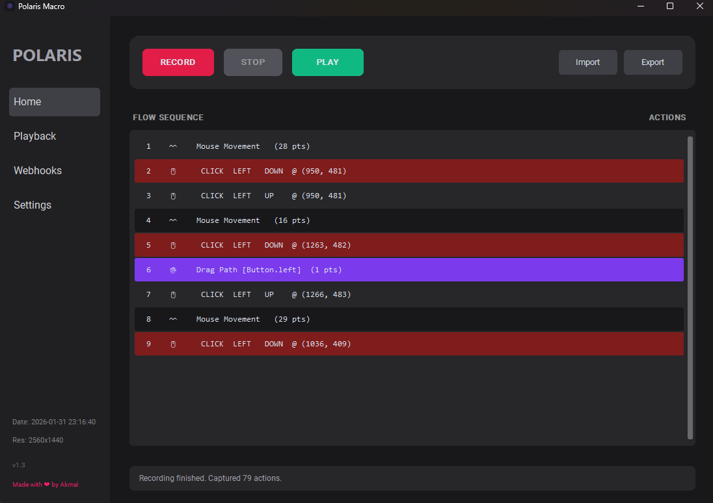
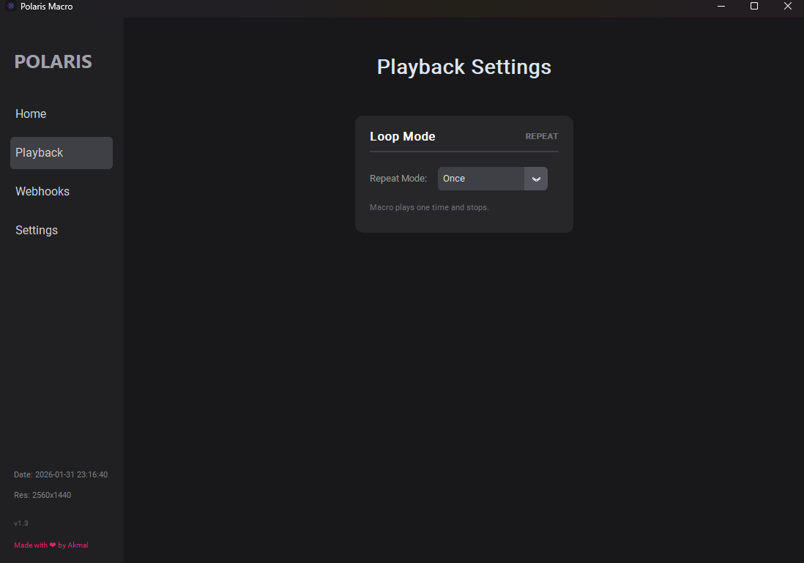
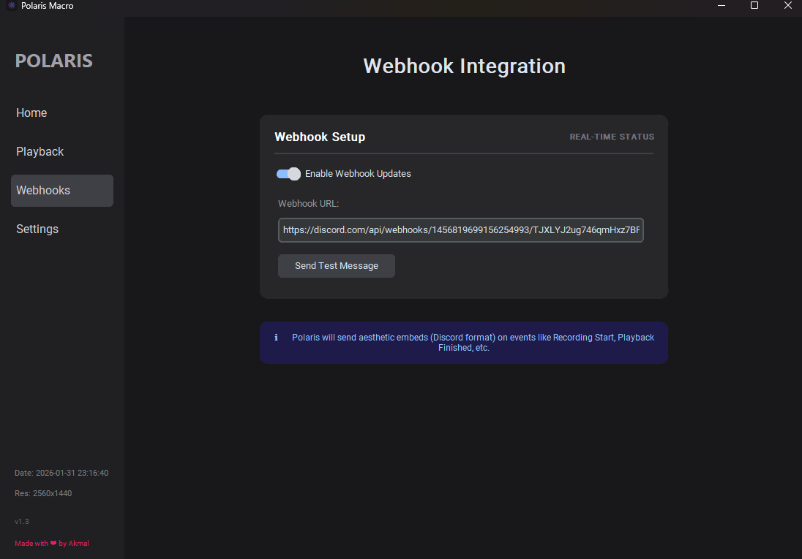
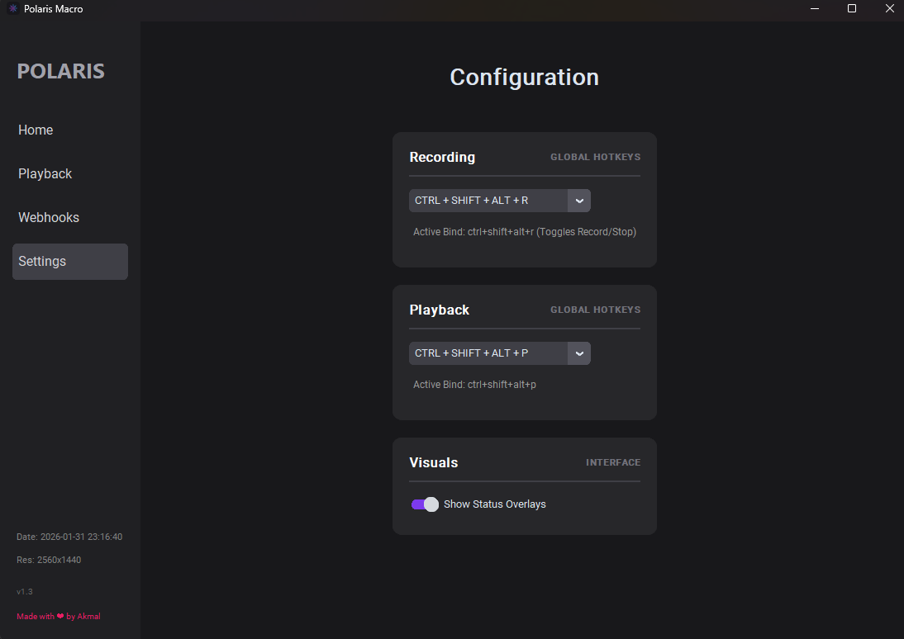

# 🌌 POLARIS MACRO
**Automation Made Simple.**

Polaris is a high-performance, aesthetically pleasing macro recording and playback system. Designed for precision and reliability, Polaris allows you to automate repetitive tasks with ease while maintaining a sleek, modern interface.

---

## ✨ Features

<b>🚀 Core Automation</b>

 

- **High-Precision Tracking**: Captures every mouse movement, click, and keystroke with millisecond accuracy.
- **Global Hotkeys**: Control everything from anywhere with customizable triggers (F8/F12 or custom combos).
- **Smart Trimming**: Automatically removes hotkey triggers from the start and end of recordings for clean macros.
- **Resolution Guardian**: Detects and warns you if you load a macro recorded on a different screen resolution.

<b>🔄 Advanced Playback</b>

 

- **Flexible Loop Modes**:
    - **Once**: Plays the sequence and stops.
    - **Count**: Repeats the macro for a specific number of cycles (1-9999).
    - **Infinite**: Loops forever until toggled off.
- **Real-Time Status Overlay**: A modern, semi-transparent overlay shows you exactly what loop Polaris is currently on.
- **Live Workspace View**: See a visual breakdown of your macro actions directly in the home screen.

<b>🔗 Webhook Integration</b>

 

- **Discord Embed Support**: Send real-time status updates to your Discord channel.
- **Aesthetic Notifications**: Polaris sends colored embeds for:
    - 🔵 Playback/Recording start
    - ✅ Successful completion
    - ❌ Errors or failures
- **One-Click Testing**: Easily verify your connection with a built-in test button.

<b>⚙️ Customization & Security</b>

 

- **Dynamic Dark Theme**: Built with a custom Zinc/Violet palette that’s easy on the eyes.
- **Window Icon & Branding**: Includes a native taskbar icon and a premium fade-in splash screen.
- **Persistent Settings**: Saves all your preferences, hotkeys, and webhook configurations automatically.

---
## ⌨️ Default Hotkeys

| Action | Key |
| :--- | :--- |
| **Toggle Record** | `F8` |
| **Toggle Play** | `F12` |

---

## 📝 Usage Tips
- **Click Through**: The overlays are designed to show status without interfering with your clicks.
- **Resolution**: Try to play macros on the same resolution they were recorded on for the best results.
- **Webhooks**: Use Discord webhooks to monitor long-running automation tasks from your phone!

---

## ⚖️ License

This project is licensed under the **Creative Commons Attribution-NoDerivatives 4.0 International (CC BY-ND 4.0)**.

- **Attribution**: You must give appropriate credit.
- **No Derivatives**: If you remix, transform, or build upon the material, you may not distribute the modified material without giving credit.

---

*Made with ❤️ by Akmal*
